# Cmpanalyzer

The aim of this project is to create a data analysis and compression application. It is the challenge for the admission process to 42 Labs, from [42 São Paulo](https://github.com/42sp).

You can see the challenge proposal [here](Instructions.md) and the board project used for planning [here](https://github.com/users/sgkhusal/projects/3/views/1).

The project was developed in Linux OS. You can see the instructions to run it [here](#4._Sources_used_in_the_development_of_this_program)

## Table of Contents
1. [Concepts](#1._Concepts)
2. [Development](#2._Development)
3. [How to run the cmpanalyzer](#3._How_to_run_the_cmpanalyzer)
4. [Sources used in the development of this program](#4._Sources_used_in_the_development_of_this_program)

## 1. Concepts

In order to do this project I had to learn some new concepts:

1. [Encoding and decoding](#1._Encoding_and_decoding)
2. [Data Compression](#2._Data_compression)
3. [Huffman Coding](#3._Huffman_Coding)
4. [Use of shared memory between programs](#4._Use_of_shared_memory_between_programs)

### 1. Encoding and decoding

In computers, encoding is the process of putting a sequence of characters into a specialized format for efficient transmission or storage.

Decoding is the opposite process: the conversion of an encoded format back into the original sequence of characters.

PS: these terms should not be confused with encryption and decryption, which focus on hiding and securing data. (We can encrypt data without changing the code or encode data without deliberately hiding the content.)

### 2. Data compression

Data compression is the process of encoding information using fewer bits than the original representation.

For example, each character from ASCII table is represented by 8 bits, or 1 byte - a sequence of zeros and ones. So a text (a sequence of characters) is also a big sequence of zeros and ones. The text compression aims to reduce this amount of zeros and ones, so that you need less bits to store the same information.

Compression reduces the resources required to store and transmit data (which implies in gaining performance, decreasing the time of the transmissions).

A device that performs data compression is an encoder, and one that performs the reversal of the process (decompression) is a decoder.

#### A compression can be lossy or lossless:

- Lossless compression reduces bits by identifying and eliminating redundancy. For example, the sequence "AAAAAA" (6 bytes) could be represented by the sequence "6A" (only 2 bytes). No information is lost in lossless compression. Text compression has to be losslessly.
- Lossy compression reduces bits by removing unnecessary or less important information. For example, for  music, videos and images compression some informations are not relevant and can be lost in the process.

### 3. Huffman Coding

Huffman coding is the basic foundation of modern text compression. It uses the frequencies of the charcarters in the data set to be compressed to determine variable length codes for each charcarter. Some charcarters will end up with less than 8 bits (the characters that are used very often) and others with more than 8 bits (the characters that are not used very often).

#### Compression process

Here are the steps for the compression process:

1. Count how many times each character is used

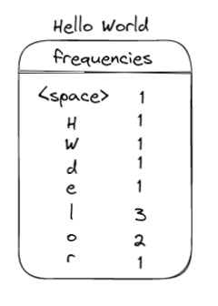

2. Order them in a linked list from the least used to the most used

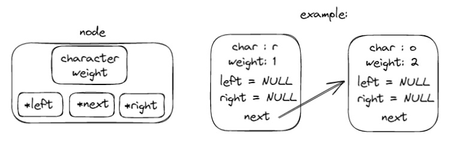

3. Create the Huffman Tree:
- Remove the 2 least used characters in the list (the two on the top), and create a new node for the tree and add their frequencies as the frequency (weight) of the node.
- Add the node sum back to the list, in the sort order

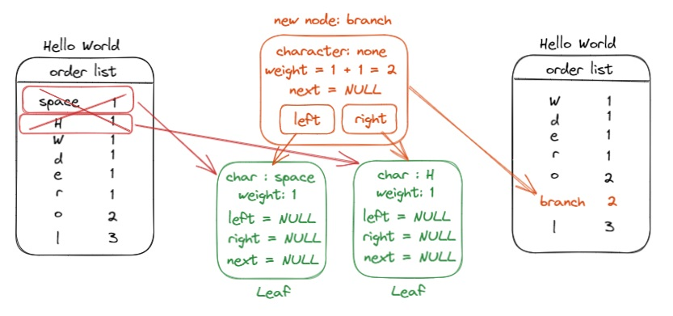

- Repeat the process until you have only one node on the list

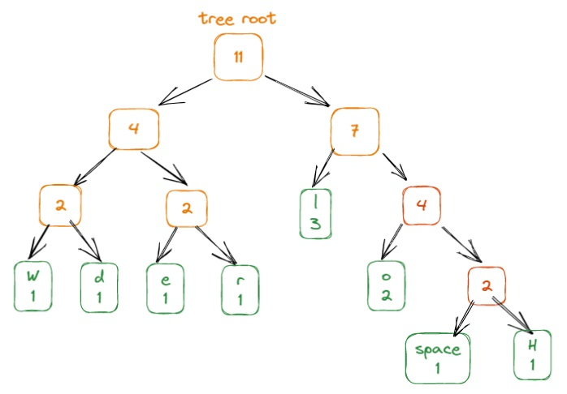

4. Create the encode table/dictionary using the Huffman Tree - the sequence of ones and zeros for each character

The Huffman Tree tells how to convert the text into ones and zeros: to know the sequence, you begin on the top and follow the path down:
- each time you take the left hand side, write 0
- each time you take the right hand side, write 1

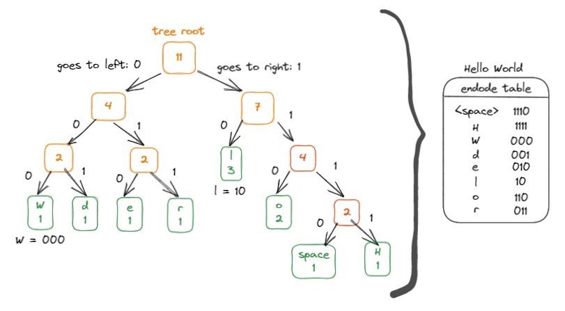

There is no ambiguity in Huffman Coding: the bit sequences are assigned in such a way that the bits assigned to one character is not the prefix of bits assigned to any other character. This because the variable-length bit sequences assigned to the characters are prefix codes.

5. Encode the text using the encode table

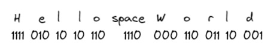

6. Compress the encoded data putting each zero and one from the encoded string into bits

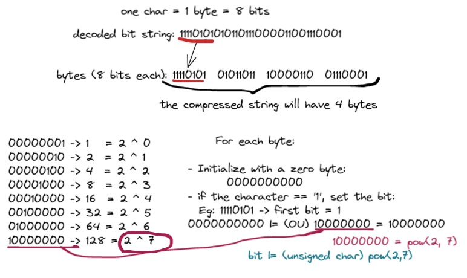

#### Decompression process

For the decompress process we have the following steps:

7. Decompress the data converting the bits into one string of zeros and ones. It is the reverse process from step 6.

8. Decode the string os zeros and ones into the original text. Here we use the Huffman Tree again instead of the encode table. This because it is not easy to know when a word begins or ends and we don't know how many characters are encoded. The Huffman Tree here works like magic!

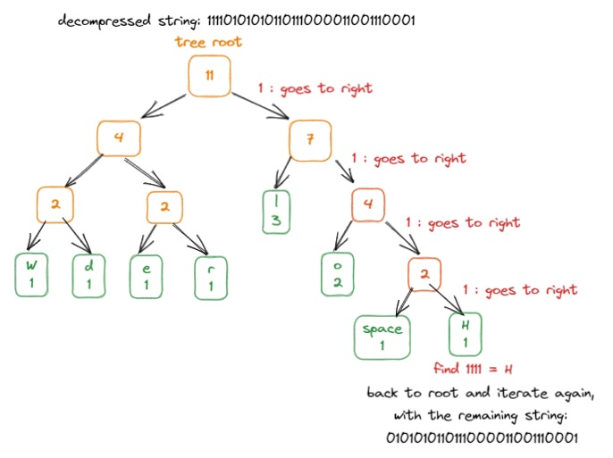

### Use of shared memory between programs

One of the requisites of this challenge is that the two independent programs, `encoder` and `decoder`, must communicate through shared memory.

For that happen, one of the process (the sender) needs to create the block of shared memory and the other (the receiver) needs to attach it to that shared memory. The enconder designates a file and associates the block of shared memory wiht that file. But we are not accessing the file content, it is used only as a reference to get access to the shared memory.

The flow used for shared the shared memory can be see in the [flowchart](#2._Flowchart) bellow.

For each kind of shared data I create a new segment of memory, according with the data type and size.

I also use shared memory to simulate two kinds of semaphors, which indicates to the program when the other one have sent the data and that it can read the shared memory. Otherwise the program wil try to access a shared memory that wasn't created yet and the process will end.

I also use the m

## 2. Flowchart

The `cpmanalyzer` program receives the input (a single and multiple strings or a single or multiple files) and make 2 [forks](https://man7.org/linux/man-pages/man2/fork.2.html) to run the `encoder` and `decoder` programs. It works like an interface to facilitate the process, but 2 programs can also be runned without the interface. The inputs are sent to the encoder only.

Encoder and decoder runs as follows:

 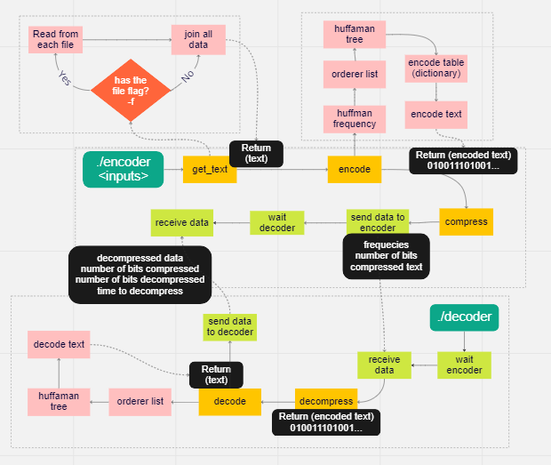
 
 The green charts indicates the communication between `encoder` and `decoder`
 
 ### The `encoder` program prints the following data that are returned by `decoder`:
- compressed bits
- decompressed bits
- decompression time
- data decompressed (separately if multiples files/strings)
- compression rate
 
 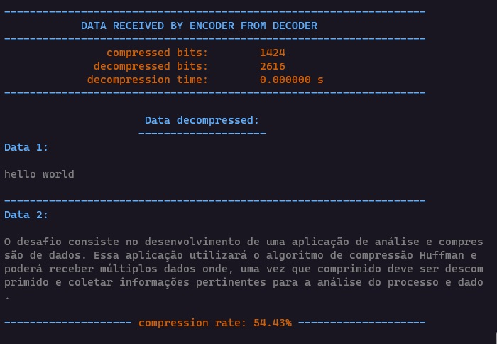

## 3. How to run the cmpanalyzer

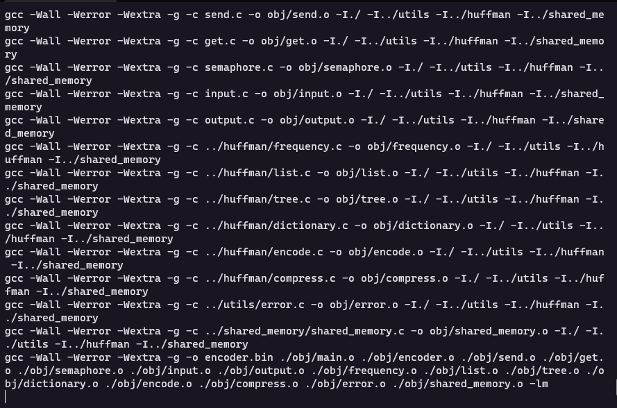

- The program was developed and test in the Linux OS (more specifically the Windows Subsystem for Linux (WSL)) so I recomend to run it in a Linux OS
- There is no need to install anything, just clone this repository
- Follow the steps:

1. `git clone https://github.com/42sp/42labs-selection-process-v4-sgkhusal.git cmpanalyzer`
2. `cd cmpanalyzer`
3. `make`
4. You can run it with multiples texts: `./cmpanalyzer "text 1" "text 2" ...`
5. Or with multiple files using the `-f` flag: 
   `./cmpanalyzer -f filename1 path/filename2 ...`
   
The `cpmanalyzer`  works like an interface to facilitate running the `encoder` and `decoder` programs. You can also run them separately, in 2 different terminals since they comunicate dependent. You also needs to run the `encoder` program first:

- `make`
- `./encoder/encoder.bin "text 1" "text 2" ...` or `./encoder/encoder.bin -f filename1 path/filename2 ...`
- in a second terminal at the program root: `./decoder/decoder.bin`

## 4. Sources used in the development of this program:
1. [encoding and decoding](https://www.techtarget.com/searchnetworking/definition/encoding-and-decoding)
2. [Data compression](https://en.wikipedia.org/wiki/Data_compression)
3. [How Computers Compress Text: Huffman Coding and Huffman Trees](https://www.youtube.com/watch?v=JsTptu56GM8)
4. [Huffman Coding](https://www.geeksforgeeks.org/huffman-coding-greedy-algo-3/)
5. [Como comprimir dados com Código de Huffman](https://www.youtube.com/watch?v=o8UPZ_KDWdU&list=PLqJK4Oyr5WShtxF1Ch3Vq4b1Dzzb-WxbP&index=1)
6. [How to Set up Shared Memory in Your Linux and MacOS Programs](https://www.youtube.com/watch?v=WgVSq-sgHOc)
7. Linux Programmer's Manual
